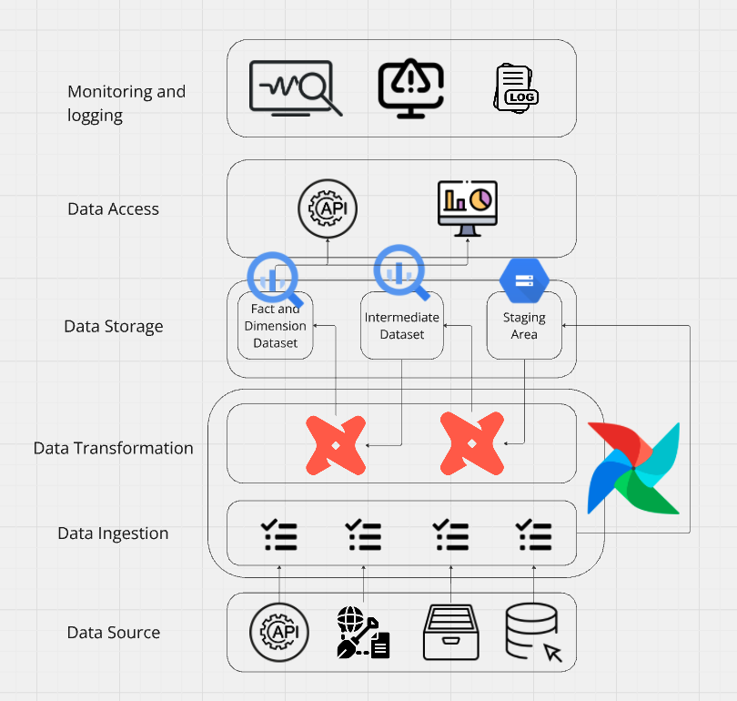
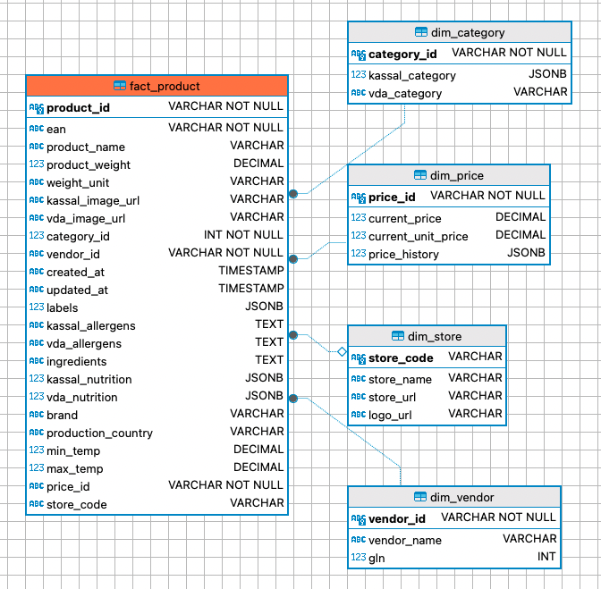

# Description:
DataSync Pro is a comprehensive data pipeline and analytics platform designed to seamlessly integrate, transform, and analyze data from multiple sources. Leveraging cutting-edge technologies such as Apache Airflow, dbt (Data Build Tool), and Google BigQuery, DataSync Pro provides a robust, scalable, and flexible solution for data-driven decision-making.

With DataSync Pro, we can automate the ingestion of data from diverse sources, ensure data quality through rigorous transformation processes, and gain real-time insights via powerful BI tools and custom APIs. The platform is designed to support hierarchical data structures and is optimized for performance, making it an ideal solution for businesses looking to unlock the full potential of their data.

# Key Features:
- Automated Data Ingestion: Seamlessly extract data from multiple sources using Airflow DAGs, ensuring timely and reliable data collection.
- Advanced Data Transformation: Utilize dbt to clean, transform, and structure data, ensuring high data quality and consistency.
- Scalable Data Storage: Store raw and transformed data in Google BigQuery, providing scalable and performant storage for large datasets.
- Comprehensive Monitoring: Monitor ETL processes, track data quality, and receive alerts for any anomalies using Airflow and custom logging solutions.
- Flexible and Modular Architecture: Easily extend the platform to accommodate new data sources and transformation requirements.

DataSync Pro empowers businesses to make informed decisions by providing a unified, high-quality data environment that supports advanced analytics and reporting.

# prod - modify following files
- profiles.yml
- sources.yml

# Architecture
The following is project architecture:

# Components
1. Airflow DAGs ('dags/')
- data_ingestion_dag.py: Contains the main DAG for orchestrating the data ingestion process.
2. DBT ('dbt/')
- 'models/': Contains dbt models:
    - transform/: Transformational dbt models.
        - intermediate: intermediate transformation
        - final/: the final star model
    - sources.yml: Source configurations for dbt.
    - dbt_project.yml: Configuration file for the dbt project.
    - profiles.yml: dbt profiles configuration file.
3. Scripts ('scripts/')
- api_ingestion_kassal.py: Script for ingesting data from Kassal API.
- api_ingestion_vda.py: Script for ingesting data from VDA API.
- gcs_upload.py: Script for uploading files to GCS.
- load_json_to_bigquery.py: Script for loading JSON files from GCS to BigQuery with specified schema.
- utils.py: Utility functions for various scripts.
4. Configuration Files
- airflow.cfg: Configuration file for Airflow.
- docker-compose.yml: Docker Compose configuration for setting up the development environment.
- Dockerfile: Dockerfile for creating a Docker image of the project.
- entrypoint.sh: Entrypoint script for Docker container.
- requirements.txt: Python dependencies required for the project.
- webserver_config.py: Configuration file for the Airflow web server.

# Data Ingestion Workflow
1. API Data Ingestion:
    - 'api_ingestion_kassal.py' and 'api_ingestion_vda.py' scripts are used to fetch data from Kassal and VDA APIs respectively.
    - The fetched data is processed and stored in local.
2. Loading Data to BigQuery:
    - 'gcs_upload.py' uploads the processed data files to GCS.
    - 'load_json_to_bigquery.py' loads the JSON files from GCS into BigQuery, using a predefined schema.
3. Data Transformation using DBT
    - The flatten SQL files in the dbt project are responsible for transforming raw data from various sources into a structured format suitable for analysis. These files ensure data consistency and prepare the data for further transformations and analysis.
    - 'flatten_kassal_product_data.sql': This SQL file processes and flattens the raw product data from the Kassal source. It ensures that each product is uniquely identified by its EAN and includes the latest product information, such as ingredients, vendor name, image URL, allergens, nutrition, and more.
    - 'flatten_vda_product_data.sql': This SQL file processes and flattens the raw product data from the VDA source. Similar to the Kassal flatten file, it ensures each product is uniquely identified by its GTIN (renamed as EAN) and includes the latest product information such as ingredients, vendor name, image URL, allergens, nutrition, and more.
    - 'merged_product_data.sql': This SQL file merges the flattened Kassal and VDA product data based on the EAN, and make necessary transformation for star models. This results in a comprehensive, merged dataset of product information.
4. Here is the final star model:
    